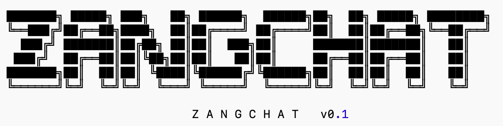

# zang_chat

  

## it is just a nanochat/GPT only to please myself,several skills learned from nanochat by Carpathy

# config:12.2:
## 1.RUSTBPE类的定义:
### 1.1函数 def train_from-iterator:我们先继承一个类，然后在我们有的vocab_size 中去除掉特殊字符的长度，然后把我们的txt，普通字符长度，pattern放进去训练（pretrain）,得到训练过的tokenizer,然后我们找到其中的mergeable_ranks_list，在用byte()转化为字符，存到dic中，再把specail_token的dic按照顺序加在ranks的后面，再放到tiktoken的encoding中编写一下

###  1.2.函数 def encode(self,text,prepend,append,num_threads)：	•	负责把 text 编码成 token id 列表 •	text 可以是	一个字符串："hello world" 或一个字符串列表：["hello", "world"]   • prepend / append：在前/后面加一个 特殊 token（或者一个已经是 int 的 token id）  •	num_threads：批量编码时，用多少线程（tiktoken 内部会并行加速）

# config：12.4:
## 1.checkpoint_manager.py 的理解：这是 ZangChat 的模型检查点管理系统（checkpoint manager），它的作用是为你的大模型训练提供 完整的保存、恢复、加载和组织功能。当模型训练时，它会在指定的 step 自动将 模型参数（model）、优化器状态（optimizer）、训练元数据（meta） 保存到磁盘；训练中断后，又可以从这些文件中精准恢复模型继续训练。它还负责从目录结构里自动找到 最新 step、最大的模型深度（例如 d32/d40），并根据 meta.json 自动构建 GPTConfig、创建 GPT 模型、载入权重、初始化 rotary embedding，再配套加载 tokenizer，实现“随时加载、即刻推理”。在多 GPU（DDP）训练时，它只让 rank0 打印日志，并为每个 rank 生成独立的 optimizer 检查点。简单说，这个文件就是 ZangChat 的 “模型存档中心 + 恢复中心”，让你的模型能 安全保存、随时恢复、方便部署、自动管理版本——是训练流程中必不可少的基础设施。ps:来自开源的项目 

## 2.common.py 的作用：先定义了一个带彩色输出的 ColoredFormatter，配好 setup_default_logging()，让你在终端看到带颜色、带时间戳的漂亮日志；print0 和全局 logger 让多卡训练时只有 rank 0 打印信息。get_base_dir() 负责确定项目的缓存 / 中间文件目录（默认放在 ~/.cache/nanochat），download_file_with_lock() 用带文件锁的方式安全下载文件，避免多进程/多卡同时下载同一个资源。print_banner() 只是开场打印一个 ZANGCHAT 的大 ASCII logo，用来提升“逼格”。is_ddp() 和 get_dist_info() 用来检测当前是否在做分布式训练，并返回 rank / world_size 等信息。autodetect_device_type() 会自动选择 cuda / mps / cpu 作为设备类型。compute_init(device_type) 是一个训练脚本通用初始化函数：检查设备是否可用、设随机种子、在 CUDA 下设置 matmul 精度、如果启用 DDP 就初始化 torch.distributed 的进程组，并最终返回 (ddp, rank, local_rank, world_size, device)；compute_cleanup() 则在程序结束时销毁进程组。最后的 DummyWandb 是个空壳类：如果你不想用 wandb 但代码里有 wandb.log(...) 之类调用，就可以用这个假对象占位，保证接口一样、但什么都不干。整体来说，这个文件就是：负责日志、美化输出、缓存路径、文件下载、设备与分布式初始化的基础工具集合，是所有训练/推理脚本共同依赖的“地基模块”。 ps:来自开源的项目 
